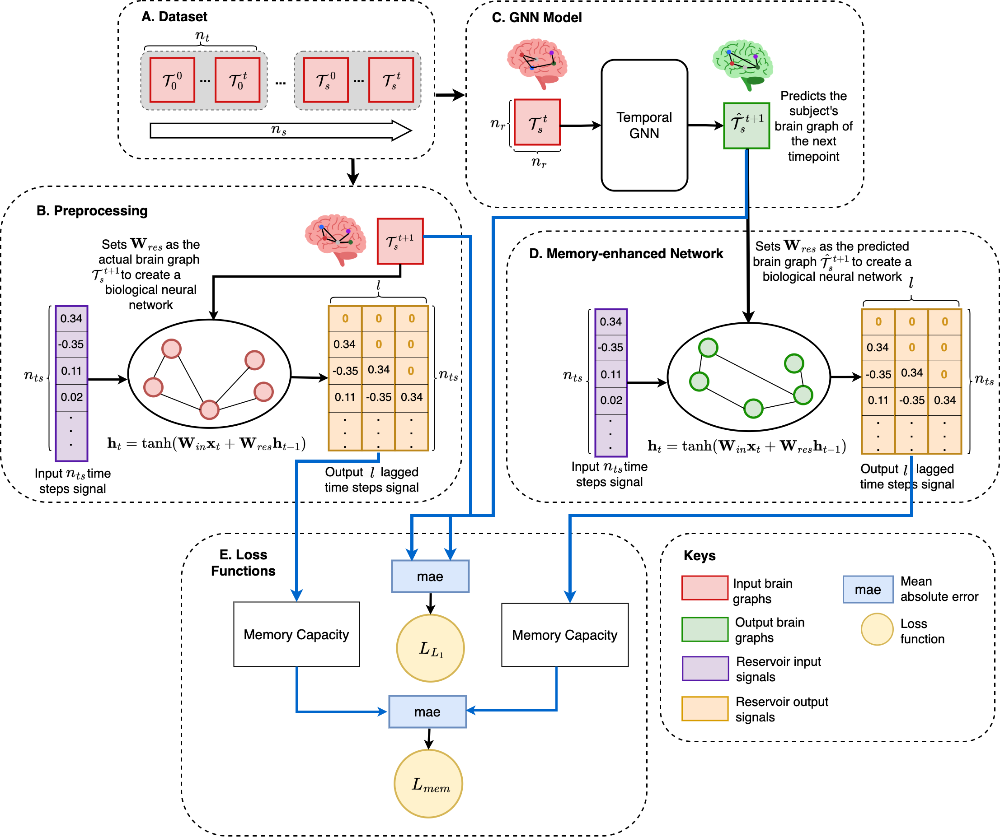

# DynGNN
Dynamic Memory-enhanced Generative GNNs for Predicting Temporal Brain Connectivity.



## Dependencies

Code for DynGNN was written using Python 3.8 and uses cudatoolkit=10.2.89. The major dependencies are listed below:

* torch >= 1.9.1
* torch_scatter >= 2.0.9
* torch_sparse >= 0.6.12
* torch_cluster >= 1.5.9
* torch_spline_conv >= 1.2.1
* torch_geometric >= 2.0.0
* torch_geometric_temporal >= 0.54.0    
* numpy >= 1.24.4
* pandas >= 1.3.5
* scikit-learn >= 1.3.2
* networkx >= 3.1

Most packages can be installed using ```pip install``` command, whereas torch_scatter, torch_sparse, torch_cluster and torch_spline_conv can be installed from using the following commands, as they are not available on PyPI:

```
pip install torch-scatter -f https://pytorch-geometric.com/whl/torch-1.7.0+cu102.html
pip install torch-sparse -f https://pytorch-geometric.com/whl/torch-1.7.0+cu102.html
pip install torch-cluster -f https://pytorch-geometric.com/whl/torch-1.7.0+cu102.html
pip install torch-spline-conv -f https://pytorch-geometric.com/whl/torch-1.7.0+cu102.html
```

## Data Format
Our model takes in brain graph that are symmetric connectivity matrix of 35x35 and requires you to provide the path of the dataset in demo.py.

## Run DynGNN
To run the code, set up the environment and run demo.py.

## Components of DynGNN's code
| Component | Content |
| ------ | ------ |
| models/ | Inside the models folder we have a variety of models implemented using the DynGNN architecture.|
| data_utils.py | Converts the data into the desired format so that DynGNN can process the data. |
| demo.py | Driver code that trains DynGNN (cross-validation). |
| datasets/ | The dataset that will be used should be stored in this folder.
| results/ | After the testing, this folder will be created. It should contain average MAE and MAE for memory capacity losses for each fold as well as the original and predicted brain graphs. |
| Jupyter notebooks | These are the experiments carried out on the DynGNN.
